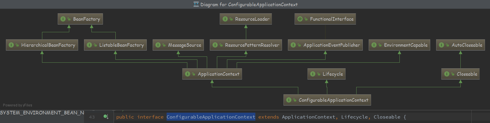

#### Spring Ioc 


#### BeanFactory

```java
public interface BeanFactory {
    String FACTORY_BEAN_PREFIX = "&";
```

- 正常getObject()拿到的是对象，"&"拿到的是产生这个Bean的工厂

##### Bean生命周期

- Bean生命周期 完整标准顺序如下
- 源码自带说明书

```java
Bean factory implementations should support the standard bean lifecycle interfaces as far as possible. The full set of initialization methods and their standard order is:
```
- set一堆Aware
- BeanPostProcessors
- InitializingBean 初始化
- 自定义的初始化方法
- BeanPostProcessors
- DestructionAwareBeanPostProcessors
- DisposableBean destroy
- 自定义销毁方法

> BeanNameAware ：可以获取容器中bean的名称
>
> BeanFactoryAware:获取当前bean factory这也可以调用容器的服务
>
> ApplicationContextAware： 当前的applicationContext， 这也可以调用容器的服务
>
> MessageSourceAware：获得message source，这也可以获得文本信息
>
> applicationEventPulisherAware：应用事件发布器，可以发布事件，
>
> ResourceLoaderAware： 获得资源加载器，可以获得外部资源文件的内容；

```java
* <li>BeanNameAware's {@code setBeanName}
* <li>BeanClassLoaderAware's {@code setBeanClassLoader}
* <li>BeanFactoryAware's {@code setBeanFactory}
* <li>EnvironmentAware's {@code setEnvironment}
* <li>EmbeddedValueResolverAware's {@code setEmbeddedValueResolver}
* <li>ResourceLoaderAware's {@code setResourceLoader}
* (only applicable when running in an application context)
* <li>ApplicationEventPublisherAware's {@code setApplicationEventPublisher}
* (only applicable when running in an application context)
* <li>MessageSourceAware's {@code setMessageSource}
* (only applicable when running in an application context)
* <li>ApplicationContextAware's {@code setApplicationContext}
* (only applicable when running in an application context)
* <li>ServletContextAware's {@code setServletContext}
* (only applicable when running in a web application context)
```
```java
* <li>{@code postProcessBeforeInitialization} methods of BeanPostProcessors

* <li>InitializingBean's {@code afterPropertiesSet}
  
* <li>a custom init-method definition

* <li>{@code postProcessAfterInitialization} methods of BeanPostProcessors
```

```java
<ol>
* <li>{@code postProcessBeforeDestruction} methods of DestructionAwareBeanPostProcessors
* <li>DisposableBean's {@code destroy}
* <li>a custom destroy-method definition
* </ol>
```


#### FactoryBean

- 一个依赖于BeanFactory，生产个性化Bean的接口，因此它也是synchronization同步的

- getObjectType() , getObject() 这两个主要方法，在启动的时候进行暴露，甚至在post-processor启动之前

- ```
  @link #getObjectType()} {@link #getObject()} invocations may arrive early in
  the bootstrap process, even ahead of any post-processor setup.
  ```
- A bean that implements this interface cannot be used as a normal bean.

- A FactoryBean is defined in a bean style

  

#### Environment

- ```
  ConfigurableEnvironment
  ```

- ```java
  PropertySourcesPlaceholderConfigurer
  ```
- Environment 应用运行的环境 ，两种表现方式 profiles 、 properties ，使用PropertyResolver接口访问属性

- Beans信息 在xml 或者 @Profile 注解 

- properties 属性来源有多种途径 JVM   ,    system   ,   JNDI  ,  servlet   ,   ad-hoc Properties objects

- ```java
  JVM system properties, system environment variables, JNDI, 
  servlet context parameters, ad-hoc Properties objects, Maps, and so on.
  ```

- ApplicationContext 对Bean 进行管理 ， 通过EnvironmentAware  或 @Inject  注册

- <font color="red">使用  PropertySourcesPlaceholderConfigurer</font> 对xml配置文件的 占位符 ${...} 修改

- Spring 3.1 注册默认使用  \<context:property-placeholder/> 管理


- @Profile 不同的环境下使用不同的@Configuration配置

- 组合类 StandardEnvironment


---


#### ApplicationContext （ 真正的集大成者 ）

```java
extends EnvironmentCapable, ListableBeanFactory, HierarchicalBeanFactory, MessageSource, ApplicationEventPublisher, ResourcePatternResolver
```

- 一个接口代表一个能力的抽象，子接口通过继承父接口，整合了父接口的功能

- ```java
   <p>An ApplicationContext provides:
  * <li>Bean factory methods for accessing application components.
  * Inherited from {@link org.springframework.beans.factory.ListableBeanFactory}.
  * <li>The ability to load file resources in a generic fashion.
  * Inherited from the {@link org.springframework.core.io.ResourceLoader} interface.
  * <li>The ability to publish events to registered listeners.
  * Inherited from the {@link ApplicationEventPublisher} interface.
  * <li>The ability to resolve messages, supporting internationalization.
  * Inherited from the {@link MessageSource} interface.
  ```
  
- 整合的能力：

   1. 对于访问应用组件提供BeanFactory
   2. 加载通用的资源文件 （资源加载器）
   3. 发布事件，注册监听器
   4. 解析消息，支持国际化

- 一个父上下文中可以使用整个web应用程序,而每个servlet有自己的子上下文无关其他servlet

- ```java
  ListableBeanFactory extends BeanFactory
  ```

- ```java
  HierarchicalBeanFactory extends BeanFactory
  ```

#### EnvironmentCapable

- 返回<font color="red">Environment     getEnvironment();</font>

  

---


- ```java
  public interface ConfigurableApplicationContext extends ApplicationContext, Lifecycle, Closeable 
  ```

- ConfigurableApplicationContext 继承了ApplicationContext 能力，它重新覆盖了EnvironmentCapable的getEnvironment方法，并且返回的是 <font color="red">ConfigurableEnvironment</font> 事实上 Environment是只读的。<font color="red">ConfigurableEnvironment</font> 是可以被配置的，进行个性定制。



#### ApplicationEventPublisher

```
@FunctionalInterface
public interface ApplicationEventPublisher {
```

- @FunctionalInterface 特点
  1. 标记在  只有一个抽象方法的 接口上
  2. 静态方法、默认方法、
  3. 接口默认继承java.lang.Object ，所以声明Object的方法，不算抽象方法
  4. 该注解能够更好地让编译器进行检查 （ 不是必须 ）

#### ConfigurableListableBeanFactory


- <font color="red">AutowireCapableBeanFactory</font>

1. 拥有自动装配能力，并把这种能力暴露给外部应用的BeanFactory类，需要实现此接口

2. 其他框架，利用该接口可以连接和填充Bean实例，且不受Spring控制

3. ApplicationContext通过方法 getAutowireCapableBeanFactory() 可以获取AutowireCapableBeanFactory
   


- ListableBeanFactory 扩展BeanFactory ,把所有的Bean实例列举出来，而不是一个个用name去找

- HierarchicalBeanFactory 分层工厂 （2个方法）

- ```java
     //返回工厂的父工厂
      BeanFactory getParentBeanFactory();
        
       //这个工厂中是否包含这个Bean
      boolean containsLocalBean(String name);
  ```

- ConfigurableListableBeanFactory 集成上图的所有接口的功能，加上自身的可配置性
- 短剑 + 短剑 = 小黄刀  ， 黄刀 + 暴风大剑 = 无尽

#### ResourcePatternResolver

<font color="red"> Strategy interface for resolving a location pattern</font>

- 策略接口，解析本地路径的资源

- 策略接口 资源加载器

- classpath*: 搜索所有jar包

- classpath:  当前路径搜索
  
  
---
#### Lifecycle  、SmartLifecycle

- Can be implemented by both components and containers  
- 生命周期 在组件和容器中实现  ， 将启动/停止信号传播到所有组件，应用到容器
- Can be used for direct invocations or for management operations via JMX.
- 可以被直接调用或通过JMX进行管理（Jconsole）

---
- SmartLifecycle provides sophisticated integration with the application context's startup and shutdown phases.
- SmartLifecycle 提供应用上下文 更复杂的 启动 ，关闭阶段。


#### ConfigurableApplicationContext


```java
ConfigurableApplicationContext extends ApplicationContext, Lifecycle, Closeable {
```

- ConfigurableApplicationContext 继承 ApplicationContext 


---


#### AbstractApplicationContext --->  抽象类

```java
abstract class AbstractApplicationContext extends DefaultResourceLoader
      implements ConfigurableApplicationContext {
```

- 抽象类 --> <font color="red">模板方法设计模式，具体的子类来实现抽象方法</font>

- ```
  an ApplicationContext is supposed
  * to detect special beans defined in its internal bean factory:
  * Therefore, this class automatically registers BeanFactoryPostProcessors BeanPostProcessors ApplicationListeners
  ```

- 应用上下文在内部BeanFactory检测特定的Beans，将 <font color="red">BeanFactoryPostProcessors、 BeanPostProcessors 、ApplicationListener</font> 这些Beans注册进上下文中

- <font color="red">MessageSource</font> 也作为Bean 在上下文中，<font color="red">ApplicationEventMulticaste</font>r 也一样作为Bean

- Implements <font color="red">resource loading</font> through extending DefaultResourceLoader  （extends DefaultResourceLoader）
  

---

重点：更新应用上下文

```java
public void refresh() throws BeansException, IllegalStateException {
   synchronized (this.startupShutdownMonitor) {
      // Prepare this context for refreshing.
      prepareRefresh();

      // Tell the subclass to refresh the internal bean factory.
      ConfigurableListableBeanFactory beanFactory = obtainFreshBeanFactory();

      // Prepare the bean factory for use in this context.
      prepareBeanFactory(beanFactory);

      try {
         // Allows post-processing of the bean factory in context subclasses.
         postProcessBeanFactory(beanFactory);

         // Invoke factory processors registered as beans in the context.
         invokeBeanFactoryPostProcessors(beanFactory);

         // Register bean processors that intercept bean creation.
         registerBeanPostProcessors(beanFactory);

         // Initialize message source for this context.
         initMessageSource();

         // Initialize event multicaster for this context.
         initApplicationEventMulticaster();

         // Initialize other special beans in specific context subclasses.
         onRefresh();

         // Check for listener beans and register them.
         registerListeners();

         // Instantiate all remaining (non-lazy-init) singletons.
         finishBeanFactoryInitialization(beanFactory);

         // Last step: publish corresponding event.
         finishRefresh();
      }

      catch (BeansException ex) {
         if (logger.isWarnEnabled()) {
            logger.warn("Exception encountered during context initialization - " +
                  "cancelling refresh attempt: " + ex);
         }

         // Destroy already created singletons to avoid dangling resources.
         destroyBeans();

         // Reset 'active' flag.
         cancelRefresh(ex);

         // Propagate exception to caller.
         throw ex;
      }

      finally {
         // Reset common introspection caches in Spring's core, since we
         // might not ever need metadata for singleton beans anymore...
         resetCommonCaches();
      }
```


- allowBeanDefinitionOverriding
- allowCircularReferences

```java
protected void customizeBeanFactory(DefaultListableBeanFactory beanFactory) {
   if (this.allowBeanDefinitionOverriding != null) {
      beanFactory.setAllowBeanDefinitionOverriding(this.allowBeanDefinitionOverriding);
   }
   if (this.allowCircularReferences != null) {
      beanFactory.setAllowCircularReferences(this.allowCircularReferences);
   }
}
```