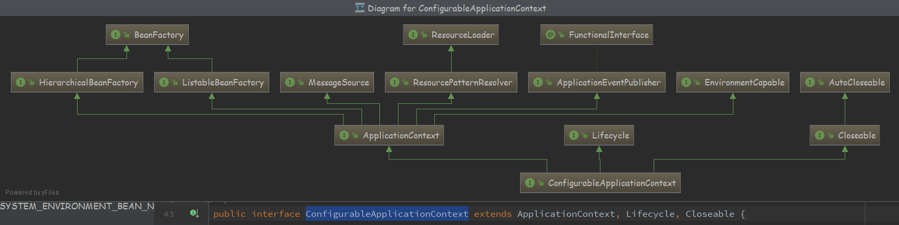

#### BeanFactory

```java
public interface BeanFactory {
    String FACTORY_BEAN_PREFIX = "&";
```

- 正常getObject()拿到的是对象，"&"拿到的是产生这个Bean的工厂

##### Bean生命周期

- Bean生命周期 完整标准顺序如下
- 源码自带说明书

```java
Bean factory implementations should support the standard bean lifecycle interfaces as far as possible. The full set of initialization methods and their standard order is:
```

```java
* <li>BeanNameAware's {@code setBeanName}
* <li>BeanClassLoaderAware's {@code setBeanClassLoader}
* <li>BeanFactoryAware's {@code setBeanFactory}
* <li>EnvironmentAware's {@code setEnvironment}
* <li>EmbeddedValueResolverAware's {@code setEmbeddedValueResolver}
* <li>ResourceLoaderAware's {@code setResourceLoader}
* (only applicable when running in an application context)
* <li>ApplicationEventPublisherAware's {@code setApplicationEventPublisher}
* (only applicable when running in an application context)
* <li>MessageSourceAware's {@code setMessageSource}
* (only applicable when running in an application context)
* <li>ApplicationContextAware's {@code setApplicationContext}
* (only applicable when running in an application context)
* <li>ServletContextAware's {@code setServletContext}
* (only applicable when running in a web application context)
    
* <li>{@code postProcessBeforeInitialization} methods of BeanPostProcessors

* <li>InitializingBean's {@code afterPropertiesSet}
    
* <li>a custom init-method definition

* <li>{@code postProcessAfterInitialization} methods of BeanPostProcessors
```

```java
<ol>
* <li>{@code postProcessBeforeDestruction} methods of DestructionAwareBeanPostProcessors
* <li>DisposableBean's {@code destroy}
* <li>a custom destroy-method definition
* </ol>
```


#### FactoryBean

- 一个依赖于BeanFactory，生产个性化Bean的接口，因此它也是synchronization同步的

- getObjectType() , getObject() 这两个主要方法，在启动的时候进行暴露，甚至在post-processor启动之前

- ```
  @link #getObjectType()} {@link #getObject()} invocations may arrive early in
  the bootstrap process, even ahead of any post-processor setup.
  ```

- ```
  A bean that implements this interface cannot be used as a normal bean.
  ```

- ```java
  A FactoryBean is defined in a bean style,
  ```


#### Environment

- ```
  ConfigurableEnvironment
  ```

- ```java
  PropertySourcesPlaceholderConfigurer
  ```

- @Profile 不同的环境下使用不同的@Configuration配置

- 组合类 StandardEnvironment


---


#### ApplicationContext

```java
extends EnvironmentCapable, ListableBeanFactory, HierarchicalBeanFactory, MessageSource, ApplicationEventPublisher, ResourcePatternResolver
```

- 一个接口代表一个能力的抽象，子接口通过继承父接口，整合了父接口的功能

- ```java
   <p>An ApplicationContext provides:
  * <li>Bean factory methods for accessing application components.
  * Inherited from {@link org.springframework.beans.factory.ListableBeanFactory}.
  * <li>The ability to load file resources in a generic fashion.
  * Inherited from the {@link org.springframework.core.io.ResourceLoader} interface.
  * <li>The ability to publish events to registered listeners.
  * Inherited from the {@link ApplicationEventPublisher} interface.
  * <li>The ability to resolve messages, supporting internationalization.
  * Inherited from the {@link MessageSource} interface.
  ```
  
- 整合的能力：

   1. 对于访问应用组件提供BeanFactory
   2. 加载通用的资源文件 （资源加载器）
   3. 发布事件，注册监听器
   4. 解析消息，支持国际化

- 一个父上下文中可以使用整个web应用程序,而每个servlet有自己的子上下文无关其他servlet

- ```java
  ListableBeanFactory extends BeanFactory
  ```

- ```java
  HierarchicalBeanFactory extends BeanFactory
  ```

#### EnvironmentCapable

- 暴露      Environment   getEnvironment();

- ```java
  public interface ConfigurableApplicationContext extends ApplicationContext, Lifecycle, Closeable 
  ```

- ConfigurableApplicationContext 继承了ApplicationContext 能力，它重新覆盖了EnvironmentCapable的getEnvironment方法，并且返回的是 <font color="red">ConfigurableEnvironment</font> 事实上 Environment是只读的。<font color="red">ConfigurableEnvironment</font> 是可以被配置的，进行个性定制。



#### ApplicationEventPublisher

```
@FunctionalInterface
public interface ApplicationEventPublisher {
```

- @FunctionalInterface 特点
  1. 标记在  只有一个抽象方法的 接口上
  2. 静态方法、默认方法、
  3. 接口默认继承java.lang.Object ，所以声明Object的方法，不算抽象方法
  4. 该注解能够更好地让编译器进行检查 （ 不是必须 ）

#### AutowireCapableBeanFactory

- 


#### ResourcePatternResolver

- 策略接口 资源加载器

- classpath*: 搜索所有jar包

- classpath:  当前路径搜索
  


#### Lifecycle


#### AbstractApplicationContext


